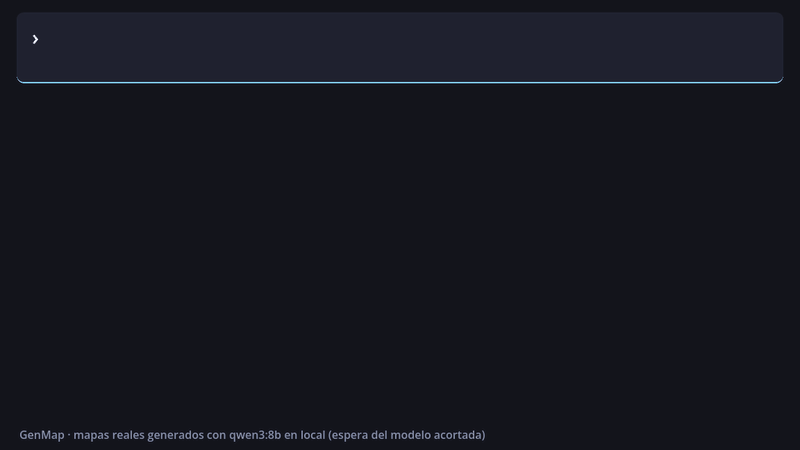

# GenMap Lite — Mazmorras 2D con IA local para Godot 4

**Describe el mapa, pulsa un botón y tendrás una mazmorra jugable en tu `TileMapLayer`.** Sin API keys, sin pagar por uso y sin internet: la IA se ejecuta en tu ordenador con [Ollama](https://ollama.com).

*Describe a dungeon in plain words and get a playable 2D map painted in your `TileMapLayer`, using a local LLM through Ollama. Free, offline, no API keys.*



<sub>La animación es de GenMap Pro, que además coloca el punto de inicio y los cofres. GenMap Lite genera los mismos mapas sin entidades. Mapas reales generados con `qwen3:8b`; la espera del modelo (3–8 s) está acortada.</sub>

---

## Qué hace

- **Del texto al mapa** desde un panel en el editor: *"mazmorra de 40x30 con 6 salas"*.
- **Mapas siempre jugables.** La IA propone el diseño y GenMap lo valida: recorta lo que se sale del mapa, conecta las salas que el modelo deja aisladas y cierra el perímetro con paredes para que el personaje no pueda salirse.
- **Paredes con colisión** si tu tile de muro tiene forma de colisión en el TileSet.
- **`Ctrl+Z`** deshace cada generación.
- **Sin congelar el editor:** el cálculo va en un hilo aparte y el pintado se reparte entre frames, con barra de progreso y botón Cancelar.
- **Botón Comprobar:** indica si Ollama está abierto y si tienes el modelo instalado.

## Lite y Pro

| | **Lite** (gratis, MIT) | **Pro** |
|---|:---:|:---:|
| Panel del editor, `Ctrl+Z`, progreso y cancelar | ✅ | ✅ |
| Suelo, paredes y salas siempre conectadas | ✅ | ✅ |
| Tamaño máximo | 48×48 | 128×128 |
| Terrenos (autotiling con Terrain Sets) | — | ✅ |
| Entidades: punto de inicio y cofres (con tu propia escena) | — | ✅ |
| Exportar e importar mapas `.json` | — | ✅ |
| API para tu juego (`GenMapAPI`) y carga de mapas exportados sin Ollama | — | ✅ |
| Presets con nombre | — | ✅ |
| Soporte | Issues de GitHub | Prioritario |

GenMap Pro está disponible en itch.io.

## Requisitos

- **Godot 4.3** o superior (usa `TileMapLayer`).
- **[Ollama](https://ollama.com/download) 0.9** o superior.
- Un modelo **Qwen3**: `qwen3:4b` (solo CPU, ~2,5 GB), `qwen3:8b` (recomendado, ~5 GB) o `qwen3:14b` (GPU de 12 GB o más, ~9 GB).

## Instalación

1. Instala Ollama y descarga el modelo:
   ```bash
   ollama pull qwen3:8b
   ```
2. Instala el plugin de una de estas formas:
   - **Asset Library:** en Godot, pestaña *AssetLib* → busca **GenMap Lite** → *Descargar* → *Instalar*.
   - **Manual:** copia la carpeta `addons/genmap/` de este repositorio en la carpeta `addons/` de tu proyecto.
3. Activa el plugin en **Proyecto > Configuración del proyecto > Plugins**. Aparecerá la pestaña **GenMap** en el panel derecho.

Para probarlo sin configurar nada, abre este repositorio como proyecto en Godot: incluye un demo con TileSet, jugador y un mapa ya generado.

## Guía rápida

1. Necesitas un **`TileMapLayer`** con un TileSet cuyo atlas (source `0`) tenga el **suelo en `(0, 0)`** y el **muro en `(1, 0)`**. Si tu atlas es distinto, cámbialo en *Ajustes avanzados*.
2. **Selecciona** el `TileMapLayer` en el árbol de escena.
3. Escribe un prompt y pulsa **Generar mapa** (o `Ctrl+Enter`).
4. ¿No te gusta? `Ctrl+Z` y vuelve a generar: cada vez sale distinto.

En el demo (`demo/demo_lite.tscn`): selecciona `Ground`, genera, guarda la escena y pulsa **F5** para recorrer el mapa con las flechas.

**Prompts de ejemplo**
- `mazmorra de 20x20 con 3 habitaciones`
- `cripta de 40x30 con 6 salas pequeñas`
- `small dungeon 30x30 with 5 rooms`

Indica siempre el tamaño (`40x30` o `40 por 30`): GenMap adapta las instrucciones del modelo para que los mapas pequeños no se repitan.

## Solución de problemas

| Mensaje | Qué hacer |
|---|---|
| *No se puede conectar con Ollama* | Abre la app de Ollama o ejecuta `ollama serve`. |
| *El modelo … no está instalado* | `ollama pull qwen3:8b`, o elige otro modelo en el panel. |
| *Ollama no respondió en 180 s* | El modelo es demasiado grande para tu equipo: prueba `qwen3:4b`. |
| *El atlas no tiene tile de suelo/muro en …* | Ajusta source y coordenadas en *Ajustes avanzados*. |
| *Ninguna habitación cae dentro del mapa* | El modelo propuso salas fuera del mapa: vuelve a generar. |

## Para contribuir

Los tests no necesitan Ollama:

```bash
godot --headless --path . --script res://tests/run_tests.gd
```

También puedes abrir `tests/run_tests_editor.gd` en el editor y pulsar *File > Run*.

## Licencia

GenMap Lite se distribuye bajo la [licencia MIT](LICENSE). Ollama y los modelos de lenguaje no se incluyen: se instalan por separado y tienen sus propias licencias.
